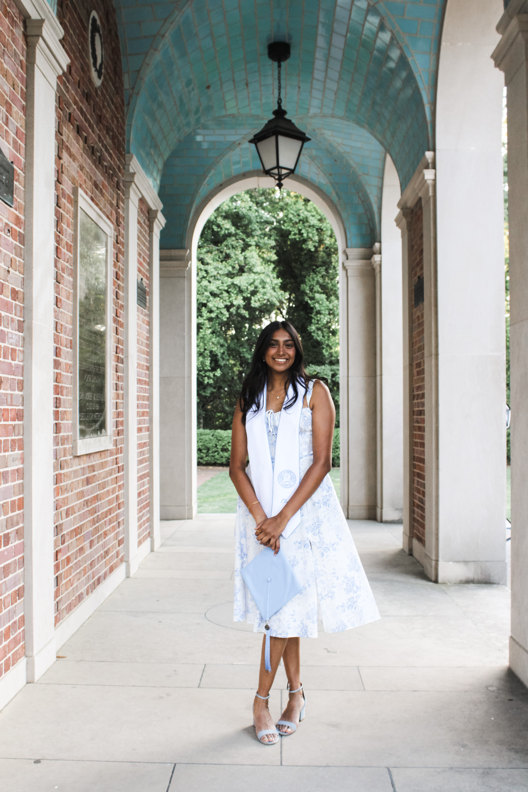

<!-- Profile Picture Section -->

  

<!-- Header Section -->

  <h1>Maya Krishnamoorthy</h1>
  <h4>M.S. Candidate, Biostatistics, Columbia University</h4>
  
  

    <a href="https://github.com/mayakrish85">GitHub</a> | 
    <a href="https://www.linkedin.com/in/mayakrishn/">LinkedIn</a> | 
    <a href="mk4995@cumc.columbia.edu">Email</a>
  

---

## About Me

Hi, I'm Maya! I am a second-year Master's student at Columbia University's Mailman School of Public Health. I am currently studying to get my M.S. in Biostatistics, with a concentration in Public Health Data Science. I graduated in May 2024 from the University of North Carolina at Chapel Hill (go Tar Heels!), with a B.S. in Computer Science and a B.S.P.H. in Biostatistics from the Gillings School of Global Public Health.

I also work at the Butler Aging Center at Columbia as a Graduate Research Assistant in the Aiello Research Group. Here, I work on the National Longitudinal Study of Adolescent to Adult Health (Add Health) study. My primary research (*which is also my master's paper!*) is focused on understanding the relationship between caregiving and cognition in early midlife. Using Add Health Wave VI data, I conduct survey-weighted analyses, including regression, SEM, and latent class analysis, to measure this association. I also support other projects related to Add CAPS measures, including but not limited to data visualization and quality control. I use R, SAS, and Mplus to conduct my analyses and prepare presentations/manuscripts for the research group. I also assist in course development for Dr. Aiello's course, "Generative AI for Epidemiology" and work on PoCs for AI deveopment in our research group (i.e. developing RAGs for agentic research and ML models for data transcription).

---

## Skills/Toolbox

**Languages:** 

- R: tidyverse, tidymodels, caret, gbm, randomForest, ranger, ggplot, plotly
- Python: pandas, numpy, matplotlib, scikit-learn, PyTorch
- MySQL
- SAS

**Methods:** causal inference, survey-weighted analyses, latent variable modeling (SEM), supervised ML, unsupervised ML, neural networks (CNNs, RNNs), NLP, time-to-event analysis

**Communication:** Shiny dashboards, reports, teaching, peer tutoring

---

## General Information

In this website, you can find links and pages associated with previous projects I've worked on, both in my graduate and undergraduate coursework. If you have any questions about any of these projects, please refer to the respective repo, or use the email listed on the website to contact me.
